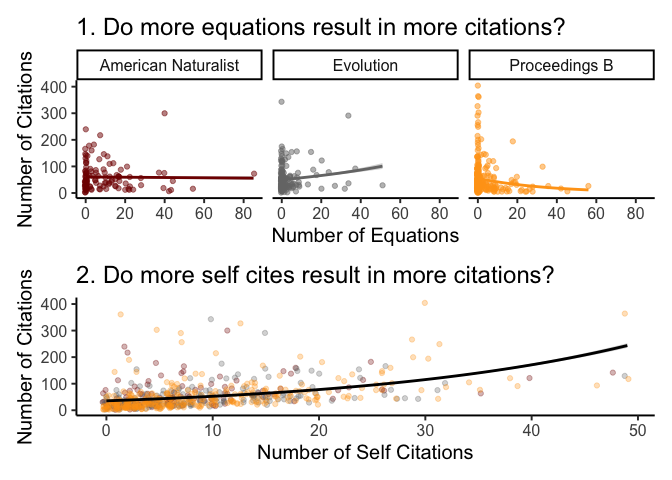

Exercise 10: Good Figures
================
DAR Lab
Spring 2021

We viewed numerous examples of bad figures. Now is your chance to make a
good (effective) figure. Please make a figure based on the following
criteria

1.  Find a
    [dataset](https://vincentarelbundock.github.io/Rdatasets/datasets.html)
    in R. You can use your own data, but these built in data sets are
    often very easy to work with.
2.  Use `ggplot()` to make your figure.
3.  Use either small multiples (`facets`) or multiple panels
    (`patchwork`), or both.
4.  Use an external color library.
5.  Prompt the figure with a question in the plot title (`ggtitle()`).
6.  Include detailed caption (but still aim for System 1 figure).

Please submit via email by 5pm Tuesday, April 13 via email, and they
will be discussed in lab the following day.

### Example

<!-- -->

``` r
library(AER) # for data
library(tidyverse) # for ggplot
library(ggsci) # for color

data(EquationCitations)

# Rename journals for complete labels
jour.labs <- c("American Naturalist", "Evolution", "Proceedings B")
names(jour.labs) <- c("AmNat", "Evolution", "ProcB")

p1 <- ggplot(EquationCitations, aes(x=equations, y = cites, color=as.factor(journal))) +
  geom_jitter(alpha = 0.5) +
  scale_color_uchicago() +
  stat_smooth(method="glm", formula = 'y ~ x', method.args = list(family = "poisson"))+
  theme_classic(base_size = 15) +
  xlab("Number of Equations") +
  ylab("Number of Citations") +
  facet_wrap(~journal,labeller = labeller(journal = jour.labs)) +
  theme(legend.position = "none") +
  ggtitle("1. Do more equations result in more citations?")

p2 <- ggplot(EquationCitations, aes(x=selfcites, y = cites)) +
  geom_jitter(alpha = 0.3, aes(color=as.factor(journal))) +
  scale_color_uchicago() +
  xlab("Number of Self Citations") +
  ylab("Number of Citations") +
  stat_smooth(method="glm", formula = 'y ~ x', col="black",
              method.args = list(family = "poisson")) +
  theme_classic(base_size = 15) +
  theme(legend.position = "none") +
  ggtitle("2. Do more self cites result in more citations?")

library(patchwork)
p1 / p2
```
