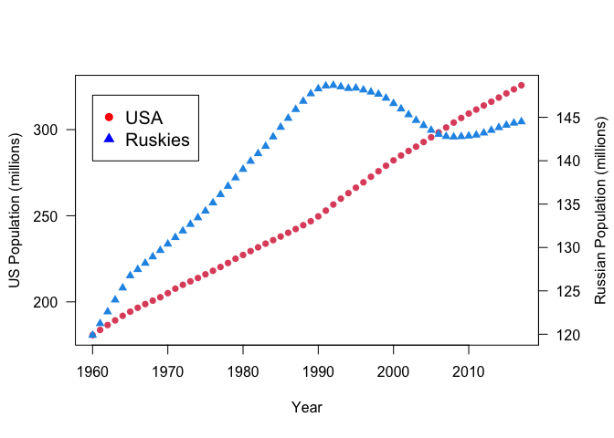
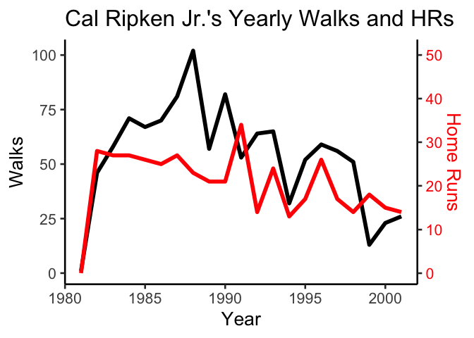

Tutorial: Adding a third axis
================
DAR Lab
Spring 2021

### Overview

In some instances, you may want a third axis on a plot. This axis,
sometimes called the *z*-axis, is typically found on the right side of
the plot. A third axis can be very useful by allowing an additional
variable to be added and compared in the same plotting layout as other
data; however, a third axis comes with the caution that with additional
axes and data, you run the risk of confusing your viewer if the plot is
not clear.

### Third axis in base plot

Let’s use the library `gt` and the `countrypops` data set, which
contains populations by year for many countries. This is a clean example
because we are using `year` as the predictor and each country we plot
has only one value per year. (In other words, plotting two busy
scatterplots this way could get messy and hard to interpret.)

``` r
library(gt)
library(tidyverse)
# countrypops

# Split data into two frames (not required)
df.us <- filter(countrypops, country_name == "United States")
df.ru <- filter(countrypops, country_name == "Russian Federation")

# Additional space for second y-axis
par(mar = c(5, 4, 4, 4) + 0.3)  

# Create first plot
plot(population/1000000 ~ year, data = df.us, 
     pch = 16, col = 2, las = 1,
     xlab = "Year",
     ylab = "US Population (millions)")      

# Add legend
legend(1960, 320, legend=c("USA", "Ruskies"),
       col=c("red", "blue"), pch=c(16, 17), cex=1.25)

# Add new plot
par(new = TRUE)  

# Create second plot without axes
plot(population/1000000 ~ year, data = df.ru, 
     pch = 17, col = 4, 
     axes = FALSE, xlab = "", ylab = "")

# Add second axis
axis(side = 4, las = 1, at = pretty(range(df.ru$population/1000000)))   

# Add label
mtext("Russian Population (millions)", side = 4, line = 3) 
```

<!-- -->

Note that these types of plots with two vertical axes can be misleading.
the Russian population appears greater than the US for much of the time
series; however, the axis scale for the Russian population is much less
than that of the US. Although if you wanted to plot them all on the same
scale, then you would not need a second axis. Perhaps a better example
would be a second axis for a second variable that is not the same
inherent units as the other axis.

### Third axis in `ggplot`

``` r
library(plyr)
data(baseball)

# subset only Cal Ripken Jr.
cal <- filter(baseball, id == "ripkeca01")

ggplot(cal, aes(x=year)) +
  geom_line(aes(y = bb), size = 2) +
  geom_line(aes(y = hr*2), color = "red", size = 2) +
  scale_y_continuous(
    sec.axis = sec_axis(~./2, name="Home Runs") ) +
  labs(x = "Year", y = "Walks") +
  theme_classic(base_size = 20) +
  theme(axis.text.y.right = element_text(color = "red"),
        axis.title.y.right = element_text(color = "red")) +
  ggtitle("Cal Ripken Jr.'s Yearly Walks and HRs")
```

<!-- -->

Note the use of colored axes reduces the need for a legend. A legend can
still be used, but for a figure like this where there are only two
lines, subtle coloration of the labels and axes can inform the reader
which line corresponds to which axis.
