Tutorial: Non-linear models
================
DAR Lab
Spring 2021

### Overview

Although this course focuses on linear models and their extensions,
there may be times when a non-linear model is needed. Generally, it is
not advised to just try a non-linear model unless you have a reason to
expect a specific type of response (curve). Non-linear models can both
easily overfit data, as well as not fit data, and so there is more risk
to using them than something like a linear model. Therefore, it can be
helpful to understand your data in terms of whether you think a
non-linear relationship is possible, and what the relationship might be.
Ultimately, this means you should get to know common (and uncommon)
non-linear curves and their common applications and associations. Here,
we will evaluate four common non-linear functions that are commonly used
in fisheries research.

First, load some libraries that have fisheries data we might want to
use, and other libraries we may use.

``` r
library(FSAdata)
library(FSA)
library(tidyverse)
```

### Model 1: Weight-Length model (exponential)

Weight and length are basic biological information that are often easily
recorded and can be useful in understanding both species and
individuals. Weight-length relationships are also often predictable in
their general form. A common weight-length model is:

*W*<sub>*i*</sub> = *α**L*<sub>*i*</sub><sup>*b*</sup>*ϵ*<sub>*i*</sub>

The terms in the model are:

| Term              | Description              |
|-------------------|--------------------------|
| *W*<sub>*i*</sub> | individual weight (data) |
| *α*               | *α* parameter            |
| *L*<sub>*i*</sub> | individual length (data) |
| *b*               | *b* parameter (\~3)      |
| *ϵ*<sub>*i*</sub> | residual error           |

Let’s plot the data to see the shape of the curve.

``` r
ggplot(RuffeSLRH92, aes(x = length, y = weight)) +
  geom_point(alpha = 0.5) +
  theme_classic(base_size = 20)
```

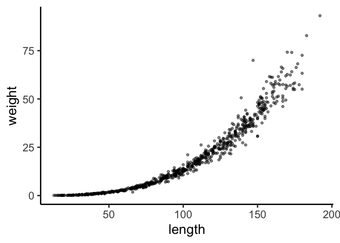<!-- -->

Looks like a good candidate for the a weight-length model. We will use
the R function `nls()` to fit this model. In `nls()` we need to specify
the formula to match the model, and like in `lm()` we exclude the
residual error term. Also note the `start` arguement. Because non-linear
parameters estimates can be very large or very small, you need to
provide a starting value that is ideally somewhat close to the parameter
value (check existing uses and fits of the model). Without starting
values, it can be hard for a non-linear model to find the right
parameter space, and this problem compounds with increasing numbers of
parameters.

``` r
wl <- nls(weight ~ a * length^b,
          data = RuffeSLRH92,
          start = list(a = 0.01, b = 3))

summary(wl)
```

    ## 
    ## Formula: weight ~ a * length^b
    ## 
    ## Parameters:
    ##    Estimate Std. Error t value Pr(>|t|)    
    ## a 3.213e-05  4.373e-06   7.347 5.41e-13 ***
    ## b 2.814e+00  2.725e-02 103.269  < 2e-16 ***
    ## ---
    ## Signif. codes:  0 '***' 0.001 '**' 0.01 '*' 0.05 '.' 0.1 ' ' 1
    ## 
    ## Residual standard error: 3.164 on 734 degrees of freedom
    ## 
    ## Number of iterations to convergence: 6 
    ## Achieved convergence tolerance: 2.895e-07
    ##   (2 observations deleted due to missingness)

Let’s check the model residuals. We are looking for residuals that are
roughly spread around 0, and display no bias or trends over a range of
values.

``` r
hist(resid(wl), col = 1, border = "white", breaks = 20, las  =1)
```

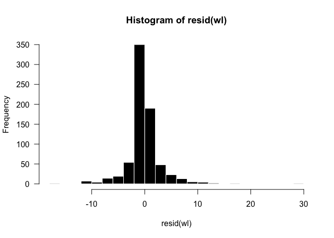<!-- -->

``` r
plot(resid(wl) ~ fitted(wl), pch=16, cex = 0.5, las = 1)
```

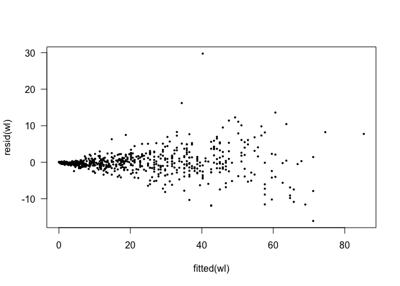<!-- -->

There a different ways to plot non-linear models.

The first way is to simply use the model coefficients to predict *y*
values from simulated *x* values. Then, plot the predicted values with a
line that will represent the model.

``` r
x.wl <- seq(1,200,length.out = 100)
y.wl <- (coef(wl)[1] * x.wl^coef(wl)[2])

plot(weight ~ length, data = RuffeSLRH92,
     pch=16, cex = 0.5, las = 1)
points(y.wl ~ x.wl, type="l", col="blue", lwd=3)
```

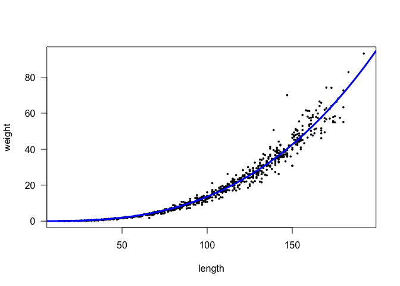<!-- -->

The second method is to use `ggplot`. For this, we use our familiar
`ggplot` syntax, but in the geom\_smooth we will add much of what we
included in `nls`.

``` r
ggplot(RuffeSLRH92, aes(x = length, y = weight)) +
  geom_point(alpha = 0.5) +
  theme_classic(base_size = 20) +
  stat_smooth(method="nls", data = RuffeSLRH92,
              formula=y~a*(x^b), # this is an nls argument
              method.args = list(start=c(a=0.01,b=3)), # this too
              se=FALSE)
```

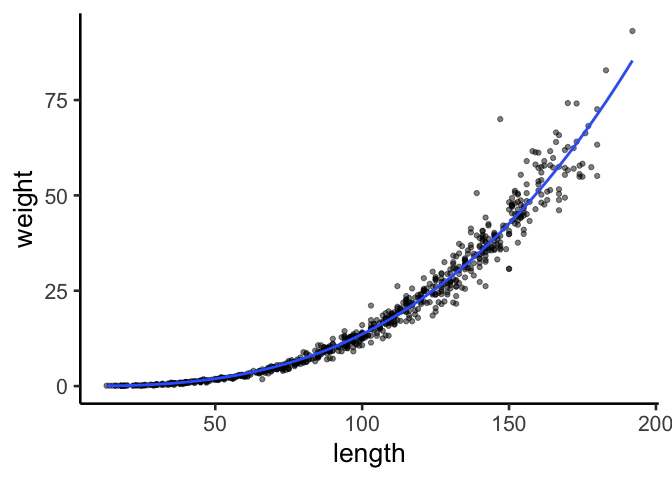<!-- -->

It is important to know a fundamental difference between plotting
non-linear models in base R vs. `ggplot`. That is, in base R you are
plotting the model you fit in `nls`. In `ggplot`, you are **re-fitting**
the model in `ggplot`. Although this should not result in any
differences, it is worth knowing.

### Model 2: Growth model

Growth is another biological process that is often non-linear. Let’s
look at some red drum data to see what the different sizes at age are
and what type of growth model we may want.

``` r
ggplot(RedDrum, aes(x = age, y = fl)) +
  geom_point(alpha = 0.5) +
  theme_classic(base_size = 20) 
```

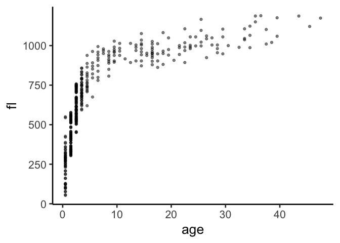<!-- -->

Based on the data, multiple different growth models could be evaluted.
We can try the von Bertalanffy growth model, which is one of the most
common and versatile growth models for fish and other taxa.

*y*<sub>*i*</sub> = *L*<sub>∞</sub>(1 − *e*( − *k*(*t*<sub>*i*</sub> − *t*<sub>0</sub>))) + *ϵ*<sub>*i*</sub>

*ϵ*<sub>*i*</sub> ∼ *N*(0, *σ*<sup>2</sup>)

The terms in the model are:

| Term              | Description              |
|-------------------|--------------------------|
| *y*<sub>*i*</sub> | individual length (data) |
| *L*<sub>∞</sub>   | mean symptotic growth    |
| *k*               | growth coefficient       |
| *t*<sub>*i*</sub> | individual age (data)    |
| *t*<sub>0</sub>   | size at age 0            |
| *ϵ*<sub>*i*</sub> | residual error           |

Now that we know the model, let’s fit in `nls`.

``` r
vb <- nls(fl ~ Linf * (1-exp(-k*(age - t0))), 
          data=RedDrum, 
          start=list(Linf=1000, k=0.5, t0=0))
summary(vb)
```

    ## 
    ## Formula: fl ~ Linf * (1 - exp(-k * (age - t0)))
    ## 
    ## Parameters:
    ##        Estimate Std. Error t value Pr(>|t|)    
    ## Linf 1007.74883    8.81906 114.269  < 2e-16 ***
    ## k       0.31593    0.01237  25.539  < 2e-16 ***
    ## t0     -0.38059    0.06725  -5.659 2.95e-08 ***
    ## ---
    ## Signif. codes:  0 '***' 0.001 '**' 0.01 '*' 0.05 '.' 0.1 ' ' 1
    ## 
    ## Residual standard error: 85.23 on 390 degrees of freedom
    ## 
    ## Number of iterations to convergence: 5 
    ## Achieved convergence tolerance: 1.628e-06

The model summary looks good. Again, we can’t really know too much about
parameters unless they have biological meaning or some reference. But in
this case, we know *L*<sub>∞</sub> is the mean asymptotic growth
estimate, which is estimated around 1000, and that is where we might put
an asymptote if we refer back to the plot. So that checks out. From
experience, *k* is typically between 0–1 (but not required), so *k* also
looks good. *t*<sub>0</sub> does not have direct biological
interpretation, but if you were to check other fish growth models, you
would find that our esitmate here is within the ballpark of other
*t*<sub>0</sub> estimates.

Now let’s check residuals.

``` r
hist(resid(vb), col = 1, border = "white", breaks = 20, las  =1)
```

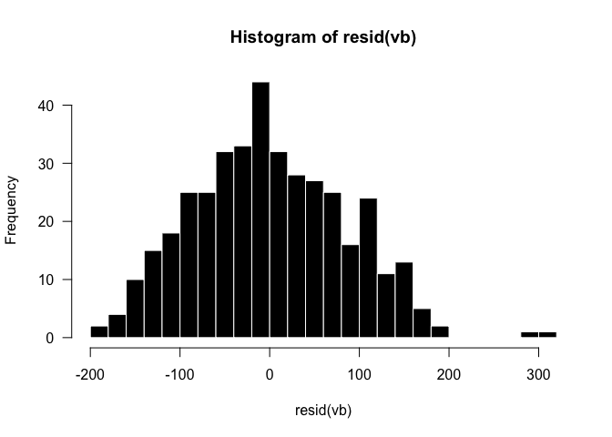<!-- -->

The histogram looks good. There are a few outliers, but very few and not
suspicious in their values.

``` r
plot(resid(vb) ~ fitted(vb), pch=16, cex = 0.5, las = 1)
abline(h = 0, col = "blue")
```

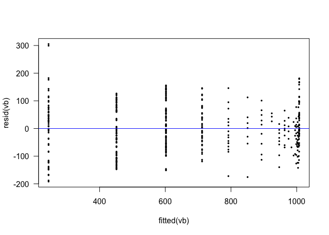<!-- -->

The plot of residuals vs. fitted values looks OK. It’s not great, but
there is no apparent bias we are concerned with. We do see that very
small and large fish are the most variable, but that is not uncommon
with fish size at age. Also, while we want to check residuals for
obvious concerns, at this level of modeling we often have the ability to
defend our model on other grounds–like similar applications of the
model.

We will skip base plotting for this, and just look at a `ggplot`.

``` r
ggplot(RedDrum, aes(x = age, y = fl)) +
  geom_point(alpha = 0.5) +
  xlab("Age (years)") +
  ylab("Fork length (mm)") +
  theme_classic(base_size = 20) +
  geom_smooth(method="nls", data = RedDrum,
              formula=y ~ Linf * (1-exp(-k*(x - t0))), 
              method.args = list(start=c(Linf=1000, k=0.5, t0=0)),
              se=FALSE)
```

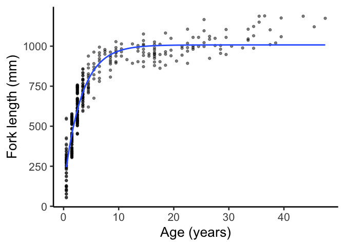<!-- -->

### Model 3: Stock-Recruitment Example

Finally, let’s look at a slightly messier (i,e,, more realistic!)
example of plotting non-linear data. Stock-recruit functions in
fisheries are notoriously problematic, although they can be very
important. Knowing how many new fish (recruits) are expected based on
your parent population is a very important dynamic for understand
populations, yet for fish, this relationship…it’s complicated.

Load some cod data and take a look at the stock-recruit relationship.

``` r
cod <- read.csv(url('https://raw.githubusercontent.com/droglenc/FSA/master/data-raw/CodNorwegian.csv'))

ggplot(cod, aes(x = stock, y = recruits)) +
  geom_point(alpha = 0.5) +
  theme_classic(base_size = 20) +
  ggtitle("Cod stock-recruit data")
```

<!-- -->

Oh, boy. And this is one of the better stock-recruit relationships! It
appears we have initial increase in recruits as stock increases (which
makes sense) and then a decrease in recruits after some maximum. This
could also make sense as density depdendence kicks in. (Although out of
the scope of this example, there are numberous stock-recruit functions
that are all based on different stock-recruit dynamics seen in different
fish species.)

Let’s consider a model that goes up and then down. Not a parabola, but
similar. One model like that is the Hollings Type IV curve.

``` r
h4 <- nls(recruits ~ (a*stock^2)/(b + c*stock + stock^2), data = cod, start = list(a = 5, b = 1, c = 1)) 
summary(h4)
```

    ## 
    ## Formula: recruits ~ (a * stock^2)/(b + c * stock + stock^2)
    ## 
    ## Parameters:
    ##   Estimate Std. Error t value Pr(>|t|)    
    ## a    70.36      15.80   4.454  0.00022 ***
    ## b   426.14     243.85   1.748  0.09516 .  
    ## c   -27.23      14.08  -1.933  0.06681 .  
    ## ---
    ## Signif. codes:  0 '***' 0.001 '**' 0.01 '*' 0.05 '.' 0.1 ' ' 1
    ## 
    ## Residual standard error: 49.83 on 21 degrees of freedom
    ## 
    ## Number of iterations to convergence: 14 
    ## Achieved convergence tolerance: 8.923e-06

Again, the parameters are not that intuitive for us, so let’s see how
the model fits the data.

``` r
ggplot(cod, aes(x = stock, y = recruits)) +
  geom_point(alpha = 0.5) +
  theme_classic(base_size = 20) +
  geom_smooth(method="nls", data = cod,
              formula=y ~ (a*x^2)/(b + c*x + x^2), 
              method.args = list(start=c(a = 5, b = 1, c = 1)),
              se=FALSE) +
  ggtitle("Hollings Type IV Function")
```

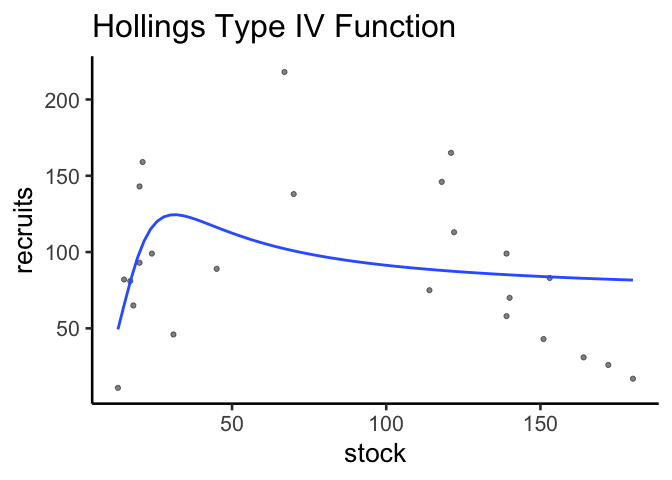<!-- -->

``` r
# -2b/c = peak
```

Meh. The function kind of captures the quick increase and slow decrease
that we think is at play, but it just doesn’t have what appears to be a
good predictive fit. It might be worth while to investigate residuals
(but we’ll skip that for now).

Let’s try a Ricker curve, which is perhaps the most well-known of the
stock-recruit functions.

``` r
rick <- nls(recruits ~ a*stock*exp(-b*stock), 
            data = cod, 
            start = list(a = 10, b = 0.1)) 
summary(rick)
```

    ## 
    ## Formula: recruits ~ a * stock * exp(-b * stock)
    ## 
    ## Parameters:
    ##   Estimate Std. Error t value Pr(>|t|)    
    ## a 6.658083   1.039433   6.405 1.91e-06 ***
    ## b 0.017369   0.001734  10.019 1.17e-09 ***
    ## ---
    ## Signif. codes:  0 '***' 0.001 '**' 0.01 '*' 0.05 '.' 0.1 ' ' 1
    ## 
    ## Residual standard error: 41.1 on 22 degrees of freedom
    ## 
    ## Number of iterations to convergence: 9 
    ## Achieved convergence tolerance: 2.381e-06

And now look at it.

``` r
ggplot(cod, aes(x = stock, y = recruits)) +
  geom_point(alpha = 0.5) +
  theme_classic(base_size = 20) +
  geom_smooth(method="nls", data = cod,
              formula=y ~ a*x*exp(-b*x), 
              method.args = list(start=c(a = 10, b = 0.1)),
              se=FALSE) +
  ggtitle("Ricker Curve")
```

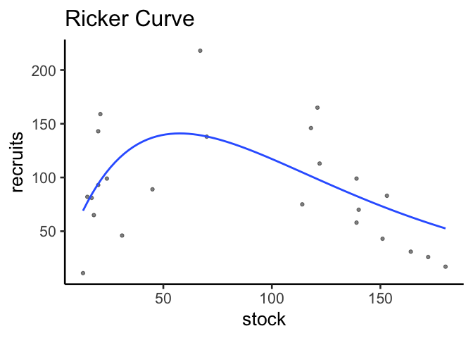<!-- -->

The Ricker curve has a much better look (but that’s just visual appeal).
The line really seems to get closer to more points than the Hollings
Type IV Function. Let’s look at both on the same data.

``` r
ggplot(cod, aes(x = stock, y = recruits)) +
  geom_point(alpha = 0.5) +
  theme_classic(base_size = 20) +
  geom_smooth(method="nls", data = cod,
              formula=y ~ a*x*exp(-b*x), 
              method.args = list(start=c(a = 10, b = 0.1)),
              se=FALSE) +
    geom_smooth(method="nls", data = cod, color = "red",
              formula=y ~ (a*x^2)/(b + c*x + x^2), 
              method.args = list(start=c(a = 5, b = 1, c = 1)),
              se=FALSE)
```

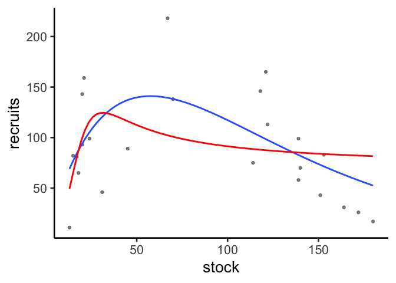<!-- -->

At this point we could probably pick the better model based on visuals
(Ricker) and the fact that the Ricker curve is commonly used with these
data sets. And again, we could perhaps look at residuals for more
inference (which you are encouraged to do). But let’s get our AIC tool
out for a quick direct comparison.

The AIC estimate for the Hollings Type IV function is 261 and the AIC
for the Ricker model is 250. The Ricker model is a better fit, based on
AIC, the visual, and it’s application.

### Troubleshooting `nls` models

If your model doesn’t fit, the best advice is to check (google) the
error message. However, because error messages won’t be covered here,
below are some of the common fixes to `nls` problems.

1.  Bad starting values. Your models will do much better if you can give
    them starting values in the area of the expected estimate. This does
    not mean you need to guess the estimate, but if a parameter is
    typically estimated between 1–5, a starting value of 3 is very
    helpful compared to a starting value of, for example, 100.

2.  Formula misspecified. Although this is not a model fitting error,
    some non-linear functions can get heavy in the equations and
    remembering order of operations is important. One misplaced
    parenthesis, for example, can cause your entire model to fail to
    even run.

3.  Poor data. A linear model will happily fit a line to any collection
    of points. This is not necessarily a good thing, but we sometimes
    take it for granted. Non-linear models, on the other hand, simply
    won’t fit if the parameters can’t find a good estimate, which
    sometimes happens because the data do not clearly fit the model. You
    could think of this is has a problem when *R*<sup>2</sup> is low in
    your linear model. Troubleshoots involve using fake (well-behaved)
    data to see if the model fits, and if it does, then it might just be
    your actual data. There are other work-arounds, but they go beyond
    what we will covere here.
